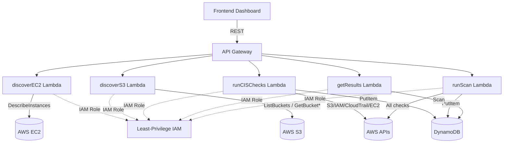

# Cloud Posture Scanner – AWS Security Posture Assessment Tool

A **serverless cloud security scanner** built on AWS that continuously discovers resources and evaluates them against CIS AWS Benchmark controls. Backend is fully managed via AWS Lambda + API Gateway + DynamoDB; frontend is a clean, standalone dashboard.

---

## Architecture

```
 Browser / Postman
       │
       ▼
 API Gateway (REST)
       │
       ├─ GET  /instances  ──► discoverEC2 Lambda  ──► AWS EC2 API
       │
       ├─ GET  /buckets    ──► discoverS3 Lambda   ──► AWS S3 API
       │
       ├─ GET  /cis-results──► getResults Lambda   ──► DynamoDB (scan)
       │
       └─ POST /scan       ──► runScan Lambda ─────► All AWS APIs
                                                          │
                                                          ▼
                                                    DynamoDB Table
                                                   (scan_results)
```



---

## CIS Benchmark Checks Implemented

| # | Check ID | Description |
|---|----------|-------------|
| 1 | `S3_PUBLIC_ACCESS` | S3 buckets must have all public access blocks enabled |
| 2 | `S3_ENCRYPTION` | S3 buckets must have server-side encryption configured |
| 3 | `IAM_ROOT_MFA` | Root account must have MFA enabled |
| 4 | `CLOUDTRAIL_ENABLED` | CloudTrail must be active and logging |
| 5 | `SG_OPEN_SSH_RDP` | Security groups must not expose port 22/3389 to 0.0.0.0/0 |
| 6 | `IAM_ACCESS_KEY_AGE` | IAM user access keys must be rotated within 90 days |

---

## Prerequisites

| Tool | Version | Install |
|------|---------|---------|
| Node.js | 18+ | [nodejs.org](https://nodejs.org) |
| AWS CLI | 2.x | [aws.amazon.com/cli](https://aws.amazon.com/cli) |
| AWS SAM CLI | 1.x | [docs.aws.amazon.com/serverless-application-model](https://docs.aws.amazon.com/serverless-application-model/latest/developerguide/install-sam-cli.html) |
| AWS Account | — | With appropriate permissions |

---

## Deployment

### 1. Configure AWS credentials
```bash
aws configure
# Enter: AWS Access Key ID, Secret Access Key, Region (e.g. us-east-1), Output format (json)
```

### 2. Install dependencies
```bash
cd /home/ayush/Desktop/visiblaze-assignment
npm install
```

### 3. Build with SAM
```bash
sam build
```

### 4. Deploy (first time – interactive)
```bash
sam deploy --guided
```
Follow the prompts:
- **Stack name**: `cloud-posture-scanner`
- **Region**: `us-east-1` (or your preferred region)
- **Confirm changeset**: `y`
- **Allow SAM to create IAM roles**: `y`
- Save to samconfig.toml: `y`

Subsequent deploys:
```bash
sam deploy
```

### 5. Get the API URL
After deploy, SAM prints:
```
Outputs
---------------------------------------------
Key    ApiBaseUrl
Value  https://XXXXXXXX.execute-api.us-east-1.amazonaws.com/Prod
```

### 6. Configure the frontend
Open `frontend/app.js` and replace the placeholder:
```js
const API_BASE_URL = "https://XXXXXXXX.execute-api.us-east-1.amazonaws.com/Prod";
```

### 7. Open the dashboard
```bash
open frontend/index.html    # macOS
xdg-open frontend/index.html  # Linux
```

---

## API Reference

### `GET /instances`
Returns discovered EC2 instances.

**Response:**
```json
{
  "count": 2,
  "instances": [
    {
      "instanceId": "i-0abc123",
      "instanceType": "t3.micro",
      "region": "us-east-1",
      "state": "running",
      "publicIp": "54.12.34.56",
      "privateIp": "10.0.1.45",
      "securityGroups": [{ "groupId": "sg-abc", "groupName": "default" }],
      "launchTime": "2025-01-01T00:00:00Z",
      "tags": { "Name": "web-server" }
    }
  ]
}
```

---

### `GET /buckets`
Returns discovered S3 buckets with security metadata.

**Response:**
```json
{
  "count": 3,
  "buckets": [
    {
      "bucketName": "my-data-bucket",
      "region": "us-east-1",
      "encryptionStatus": "aws:kms",
      "isPublic": false,
      "publicAccessBlockEnabled": true
    }
  ]
}
```

---

### `GET /cis-results`
Returns all stored CIS benchmark results from DynamoDB.

**Query Parameters:**
| Param | Type | Description |
|-------|------|-------------|
| `status` | `PASS` \| `FAIL` | Filter by result status |
| `checkName` | string | Filter by check name (e.g. `S3_ENCRYPTION`) |

**Response:**
```json
{
  "summary": { "total": 12, "passed": 9, "failed": 3 },
  "results": [
    {
      "checkName": "S3_ENCRYPTION",
      "status": "FAIL",
      "affectedResource": "my-legacy-bucket",
      "evidence": "Encryption not configured: NoSuchEncryptionConfiguration",
      "timestamp": "2026-03-07T07:34:00Z"
    }
  ]
}
```

---

### `POST /scan`
Triggers a full cloud posture scan. Runs all 6 CIS checks and stores results to DynamoDB.

**Response:**
```json
{
  "scanStartedAt": "2026-03-07T07:34:00Z",
  "scanCompletedAt": "2026-03-07T07:34:28Z",
  "summary": { "total": 12, "passed": 9, "failed": 3 },
  "results": [ ... ]
}
```

---

## Project Structure

```
visiblaze-assignment/
├── template.yaml              # AWS SAM infrastructure-as-code
├── package.json               # Node.js dependencies
├── .env.example               # Required environment variables reference
│
├── lambdas/
│   ├── discoverEC2/
│   │   └── index.js           # GET /instances handler
│   ├── discoverS3/
│   │   └── index.js           # GET /buckets handler
│   ├── runCISChecks/
│   │   └── index.js           # Runs 6 CIS checks, stores to DynamoDB
│   ├── getResults/
│   │   └── index.js           # GET /cis-results handler
│   └── runScan/
│       └── index.js           # POST /scan – full orchestrated scan
│
└── frontend/
    ├── index.html             # Dashboard UI
    ├── style.css              # Premium dark-mode styles
    └── app.js                 # API calls + table rendering
```

---

## Security

- **No hardcoded credentials** – all auth via IAM roles attached to Lambda
- **Least-privilege IAM** – each Lambda has its own role with only the minimum permissions it needs
- **DynamoDB encryption** – table has SSE enabled by default
- **CORS** – API Gateway allows `*` origins (restrict in production)
- **Environment variables** – `AWS_REGION` and `DYNAMODB_TABLE` are injected by SAM

---

## Cleanup

To remove all deployed resources:
```bash
sam delete --stack-name cloud-posture-scanner
```
